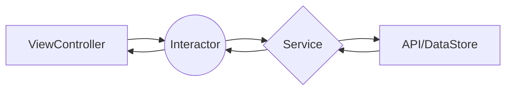

# GitHub Direct Messaging app

I have chosen the scenario B where I can design the main stucture of the application and define the architecture to organise code and make it testable so it can be maintainable by the team in the long run. 

### Architecture
In this project I have implemented a scablable, maintanable and testable application, I had choosen a simple architecture, fast in terms of developement time based on 3 components:
- Interactor/Presenter
- Service
- ViewController

#### Advantages
- Create unit testing for interactor, mocking service and the dataStore layer.
- Faster development process
- Writing clean code and seperate bussiness logic code from the UI.

#### Disadvantages
- Architecture like MVVM, Viper let you write better unit testing as there are more layer to test such view model. (But it needs more code and files and it can be overlkill sometimes for simple pages.) 

**Interactor**: This is the “mediator” between the Service and the ViewController. It have input and output protocol where it communicates with ViewController and pass the paramters to the service. The Service will return a response and the Interactor will pass it back to ViewController. 

Example: ChatViewController passes to the interactor the user id param where  the interator send it to the service to get the messages and posts/presents data back to View.

**Service**: This layer will handle all API/Core data calls. It is initiated by the interactor. It get the data and return them back to interactor.

### Storage
MessagesStore is singleton component responsible to store/retreive messages for each userID.

### Communication
The comunication between the components is done with protocols.

